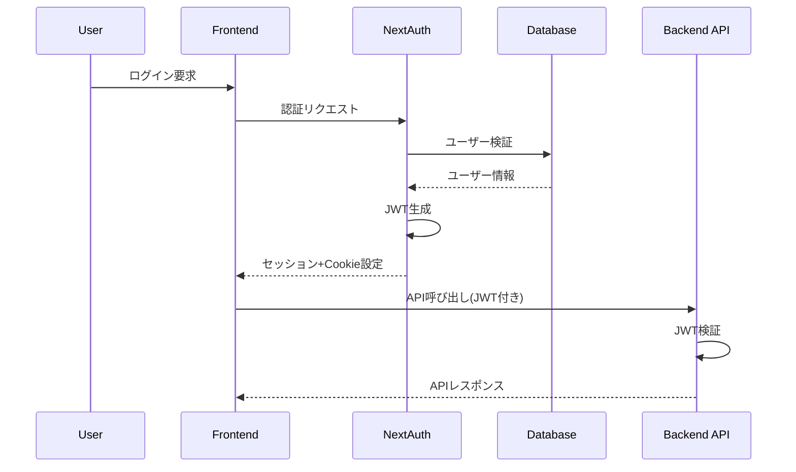

# セッション管理とトークン処理戦略

## 作成者: worker3
## 作成日: 2025-06-23

---

## 1. セッション管理アーキテクチャ

### 1.1 NextAuth JWTセッション

```
┌─────────────┐     ┌─────────────┐     ┌─────────────┐
│   Client    │────▶│  NextAuth   │────▶│   Backend   │
│  (Browser)  │     │    (JWT)    │     │    API      │
└─────────────┘     └─────────────┘     └─────────────┘
      │                    │                    │
      │    httpOnly Cookie │                    │
      └────────────────────┴────────────────────┘
```

### 1.2 セッション構成要素

#### JWTトークン構造
```typescript
interface SessionToken {
  // ユーザー識別情報
  id: string;              // ユーザーID
  email: string;           // メールアドレス
  name?: string;           // ユーザー名
  image?: string;          // プロフィール画像
  
  // 権限情報
  role: string;            // ユーザーロール (user/admin/premium)
  permissions?: string[];  // 細かい権限リスト
  
  // プロバイダー情報
  provider?: string;       // 認証プロバイダー
  providerAccountId?: string;
  
  // セッション管理
  iat: number;            // 発行時刻
  exp: number;            // 有効期限
  jti?: string;           // JWT ID（セッション識別子）
  
  // セキュリティ
  emailVerified?: Date;   // メール確認済み
  twoFactorEnabled?: boolean;
}
```

---

## 2. トークンライフサイクル管理

### 2.1 トークン発行フロー



### 2.2 トークン更新戦略

#### 自動更新メカニズム
```typescript
// /src/lib/session-refresh.ts
export class SessionRefreshManager {
  private static readonly REFRESH_THRESHOLD = 7 * 24 * 60 * 60; // 7日
  private static readonly TOKEN_LIFETIME = 30 * 24 * 60 * 60; // 30日

  /**
   * トークンの自動更新判定
   */
  static shouldRefreshToken(token: JWT): boolean {
    const now = Date.now() / 1000;
    const timeUntilExpiry = token.exp - now;
    
    return timeUntilExpiry < this.REFRESH_THRESHOLD;
  }

  /**
   * トークン更新処理
   */
  static async refreshToken(token: JWT): Promise<JWT> {
    // ユーザーアクティビティを記録
    await this.logUserActivity(token.id);
    
    // 新しい有効期限を設定
    const newToken = {
      ...token,
      iat: Math.floor(Date.now() / 1000),
      exp: Math.floor(Date.now() / 1000) + this.TOKEN_LIFETIME
    };
    
    // セッション履歴に記録
    await this.recordSessionRefresh(token.id, token.jti);
    
    return newToken;
  }
}
```

---

## 3. セッション永続化とストレージ

### 3.1 マルチデバイス対応

#### Prismaスキーマ拡張
```prisma
model Session {
  id            String   @id @default(cuid())
  sessionToken  String   @unique
  userId        String
  expires       DateTime
  
  // デバイス情報
  deviceName    String?
  deviceType    String?  // mobile/desktop/tablet
  browser       String?
  os            String?
  ipAddress     String?
  
  // セッション管理
  lastActivity  DateTime @default(now())
  isActive      Boolean  @default(true)
  
  user          User     @relation(fields: [userId], references: [id], onDelete: Cascade)
  
  @@index([userId])
  @@index([expires])
}
```

### 3.2 セッション管理API

```typescript
// /src/services/session-service.ts
export class SessionService {
  /**
   * アクティブセッション一覧取得
   */
  static async getUserSessions(userId: string): Promise<SessionInfo[]> {
    const sessions = await prisma.session.findMany({
      where: {
        userId,
        expires: { gt: new Date() },
        isActive: true
      },
      orderBy: { lastActivity: 'desc' }
    });

    return sessions.map(session => ({
      id: session.id,
      deviceName: session.deviceName || 'Unknown Device',
      deviceType: session.deviceType || 'unknown',
      browser: session.browser,
      ipAddress: session.ipAddress,
      lastActivity: session.lastActivity,
      isCurrent: session.sessionToken === currentSessionToken
    }));
  }

  /**
   * セッション無効化
   */
  static async revokeSession(userId: string, sessionId: string): Promise<void> {
    const session = await prisma.session.findFirst({
      where: { id: sessionId, userId }
    });

    if (!session) {
      throw new Error('セッションが見つかりません');
    }

    await prisma.session.update({
      where: { id: sessionId },
      data: { isActive: false, expires: new Date() }
    });

    // 監査ログに記録
    await this.logSessionRevocation(userId, sessionId);
  }

  /**
   * 全セッション無効化（ログアウト）
   */
  static async revokeAllSessions(userId: string): Promise<void> {
    await prisma.session.updateMany({
      where: { userId },
      data: { isActive: false, expires: new Date() }
    });

    await this.logAllSessionsRevocation(userId);
  }
}
```

---

## 4. セキュリティ実装

### 4.1 トークンセキュリティ

#### セキュアなCookie設定
```typescript
// /src/lib/cookie-config.ts
export const sessionCookieConfig = {
  httpOnly: true,                    // XSS対策
  secure: process.env.NODE_ENV === 'production', // HTTPS必須
  sameSite: 'lax' as const,         // CSRF対策
  path: '/',
  maxAge: 30 * 24 * 60 * 60 * 1000, // 30日
  domain: process.env.COOKIE_DOMAIN
};
```

### 4.2 セッションセキュリティ機能

#### 異常検知システム
```typescript
// /src/services/session-security.ts
export class SessionSecurityService {
  /**
   * 不審なセッション活動を検知
   */
  static async detectAnomalousActivity(userId: string, request: Request): Promise<void> {
    const recentSessions = await this.getRecentSessions(userId);
    
    // 地理的異常を検出
    const locationAnomaly = await this.detectLocationAnomaly(
      recentSessions,
      request.ip
    );
    
    // 短時間での複数デバイスログイン
    const multiDeviceAnomaly = this.detectMultiDeviceAnomaly(recentSessions);
    
    // ブルートフォース検出
    const bruteForceAttempt = await this.detectBruteForce(request.ip);
    
    if (locationAnomaly || multiDeviceAnomaly || bruteForceAttempt) {
      await this.handleSecurityAlert(userId, {
        locationAnomaly,
        multiDeviceAnomaly,
        bruteForceAttempt,
        request
      });
    }
  }

  /**
   * セキュリティアラート処理
   */
  private static async handleSecurityAlert(
    userId: string,
    alert: SecurityAlert
  ): Promise<void> {
    // ユーザーに通知
    await this.notifyUser(userId, alert);
    
    // 必要に応じてセッションを一時停止
    if (alert.severity === 'high') {
      await this.suspendUserSessions(userId);
    }
    
    // 監査ログに記録
    await this.logSecurityAlert(userId, alert);
  }
}
```

---

## 5. パフォーマンス最適化

### 5.1 セッションキャッシング

```typescript
// /src/lib/session-cache.ts
import Redis from 'ioredis';

export class SessionCache {
  private static redis = new Redis(process.env.REDIS_URL!);
  private static readonly TTL = 300; // 5分

  /**
   * セッション情報をキャッシュ
   */
  static async cacheSession(sessionId: string, data: SessionData): Promise<void> {
    const key = `session:${sessionId}`;
    await this.redis.setex(key, this.TTL, JSON.stringify(data));
  }

  /**
   * キャッシュからセッション取得
   */
  static async getCachedSession(sessionId: string): Promise<SessionData | null> {
    const key = `session:${sessionId}`;
    const cached = await this.redis.get(key);
    
    if (!cached) return null;
    
    return JSON.parse(cached);
  }

  /**
   * セッションキャッシュ無効化
   */
  static async invalidateSession(sessionId: string): Promise<void> {
    const key = `session:${sessionId}`;
    await this.redis.del(key);
  }
}
```

### 5.2 バッチ処理による効率化

```typescript
// /src/jobs/session-cleanup.ts
export class SessionCleanupJob {
  /**
   * 期限切れセッションの定期削除
   */
  static async cleanupExpiredSessions(): Promise<void> {
    const deleted = await prisma.session.deleteMany({
      where: {
        expires: { lt: new Date() }
      }
    });

    console.log(`Cleaned up ${deleted.count} expired sessions`);
  }

  /**
   * 非アクティブセッションの警告
   */
  static async warnInactiveSessions(): Promise<void> {
    const thirtyDaysAgo = new Date();
    thirtyDaysAgo.setDate(thirtyDaysAgo.getDate() - 30);

    const inactiveSessions = await prisma.session.findMany({
      where: {
        lastActivity: { lt: thirtyDaysAgo },
        isActive: true
      },
      include: { user: true }
    });

    for (const session of inactiveSessions) {
      await this.sendInactivityWarning(session.user);
    }
  }
}
```

---

## 6. 監視とロギング

### 6.1 セッションメトリクス

```typescript
// /src/monitoring/session-metrics.ts
export class SessionMetrics {
  /**
   * セッション統計情報
   */
  static async getSessionStats(): Promise<SessionStats> {
    const [total, active, expiringSoon] = await Promise.all([
      prisma.session.count(),
      prisma.session.count({
        where: { isActive: true, expires: { gt: new Date() } }
      }),
      prisma.session.count({
        where: {
          expires: {
            gt: new Date(),
            lt: new Date(Date.now() + 7 * 24 * 60 * 60 * 1000)
          }
        }
      })
    ]);

    return {
      totalSessions: total,
      activeSessions: active,
      expiringSoon,
      averageSessionDuration: await this.calculateAverageSessionDuration()
    };
  }

  /**
   * リアルタイムダッシュボード用データ
   */
  static async getRealtimeMetrics(): Promise<RealtimeMetrics> {
    return {
      currentActiveUsers: await this.getActiveUserCount(),
      newSessionsLastHour: await this.getNewSessionsCount(60),
      averageSessionsPerUser: await this.getAverageSessionsPerUser(),
      topDeviceTypes: await this.getTopDeviceTypes()
    };
  }
}
```

---

## 7. 実装チェックリスト

### 必須実装項目
- [ ] NextAuth JWT設定の完了
- [ ] セッション管理APIの実装
- [ ] セキュリティミドルウェアの統合
- [ ] マルチデバイス対応
- [ ] セッション無効化機能
- [ ] 監査ログの実装

### 推奨実装項目
- [ ] Redisキャッシング
- [ ] 異常検知システム
- [ ] セッションメトリクス
- [ ] 自動クリーンアップジョブ
- [ ] リアルタイムモニタリング

### オプション機能
- [ ] 生体認証連携
- [ ] ハードウェアキー対応
- [ ] セッション共有機能
- [ ] 地理的制限機能

---

## 8. トラブルシューティング

### よくある問題と解決方法

1. **セッションが頻繁に切れる**
   - Cookie設定の確認
   - sameSite属性の調整
   - ドメイン設定の確認

2. **マルチデバイスで同期しない**
   - データベース接続の確認
   - キャッシュの無効化
   - セッション更新ロジックの確認

3. **パフォーマンスの問題**
   - Redisキャッシングの有効化
   - インデックスの最適化
   - バッチ処理の実装

---

作成者: worker3
承認待ち: boss1